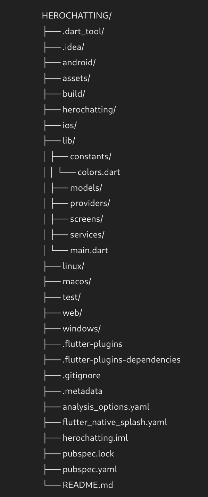
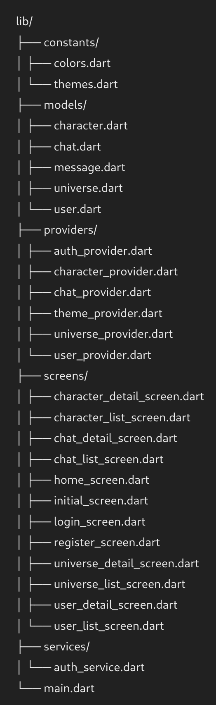

# Herochatting Documentation

## Table of Contents
1. [Introduction](#introduction)
2. [Getting Started](#getting-started)
3. [Features](#features)
4. [Technologies Used](#technologies-used)
5. [Application Structure](#application-structure)
6. [Endpoints](#endpoints)
7. [State Management](#state-management)
8. [Usage](#usage)
9. [Deployment](#deployment)

## Introduction
Herochatting is a Flutter application designed to facilitate conversations between users and characters from various universes. The application allows users to register, create and manage universes and characters, and engage in conversations with these characters. This documentation provides a detailed overview of the application's features, technologies used, structure, API endpoints, and state management.

## Getting Started

This project is a starting point for a Flutter application.

A few resources to get you started if this is your first Flutter project:

- [Lab: Write your first Flutter app](https://docs.flutter.dev/get-started/codelab)
- [Cookbook: Useful Flutter samples](https://docs.flutter.dev/cookbook)

For help getting started with Flutter development, view the
[online documentation](https://docs.flutter.dev/), which offers tutorials,
samples, guidance on mobile development, and a full API reference.

## Features

### Authentication
- **Login:** Users can log in using their username and password.
- **Registration:** Users can register by providing a username, password, first name, last name, and email.

### User Management
- **View Users:** A list of all users can be viewed, with a search function.
- **Edit Users:** User details can be viewed and edited.

### Universe Management
- **View Universes:** A list of all universes can be viewed, with options to add a new universe.
- **Edit Universes:** Universe details can be viewed and edited, including a link to view characters in the universe.

### Character Management
- **View Characters:** A list of all characters in a specific universe can be viewed.
- **Edit Characters:** Character details can be viewed and edited, and a new description can be generated for a character.

### Conversation Management
- **View Conversations:** A list of all conversations can be viewed, with options to delete conversations.
- **View Conversation Details:** Details of a specific conversation can be viewed, including the message history and options to send new messages or regenerate the last message.

### Message Loading
- When a chat is opened, only the last message is loaded. Refreshing the page loads the entire conversation history.

## Technologies Used
- **Flutter:** Version 3.19.6
- **Dart:** Version 3.3.4
- **Libraries:**
  - cupertino_icons: ^1.0.6
  - http: ^1.2.1
  - provider: ^6.0.0
  - flutter_svg: ^2.0.10+1
  - logger: ^1.1.0
  - shared_preferences: ^2.2.3
  - cached_network_image: ^3.3.1
  - flutter_native_splash: ^2.4.0

## Application Structure

### Folder Structure





### main.dart
This is the entry point of the application. It sets up the necessary providers and the app's theme.

### Constants
- **colors.dart:** Defines the color scheme for the application.

### Models
Defines the data models used in the application, including `Character`, `Chat`, `Message`, and `Universe`.

### Providers
Handles the state management for different parts of the application using the `Provider` package.
- **auth_provider.dart:** Manages authentication state.
- **character_provider.dart:** Manages state for characters.
- **chat_provider.dart:** Manages state for chats and messages.
- **theme_provider.dart:** Manages theme state.
- **universe_provider.dart:** Manages state for universes.

### Screens
Defines the UI screens for the application.
- **LoginScreen:** Screen for user login.
- **RegisterScreen:** Screen for user registration.
- **CharacterDetailScreen:** Screen for viewing and editing character details.
- **ChatDetailScreen:** Screen for viewing conversation details and sending messages.
- **UniverseDetailScreen:** Screen for viewing and editing universe details.
- **UserManagementScreen:** Screen for managing users.

### Services
Defines services for making API requests.
- **auth_service.dart:** Handles authentication-related API requests.

## Endpoints
### Users
- **Create User:** `POST /users`
- **Get One User:** `GET /users/{id}`
- **Get All Users:** `GET /users`
- **Modify User:** `PUT /users/{id}`

### Universes
- **Create Universe:** `POST /universes`
- **Rename Universe:** `PUT /universes/{id}`
- **Get Universe:** `GET /universes/{id}`
- **Get All Universes:** `GET /universes`
- **Characters in Universe:**
  - **Create Character:** `POST /universes/{universe_id}/characters`
  - **Generate Character Description:** `PUT /universes/{universe_id}/characters/{character_id}`
  - **Get Character:** `GET /universes/{universe_id}/characters/{character_id}`
  - **Get All Characters:** `GET /universes/{universe_id}/characters`

### Conversations
- **Get All Conversations:** `GET /conversations`
- **Get Conversation:** `GET /conversations/{id}`
- **Create Conversation:** `POST /conversations`
- **Messages in Conversation:**
  - **Get All Messages:** `GET /conversations/{conversation_id}/messages`
  - **Get Message:** `GET /conversations/{conversation_id}/messages/{message_id}`
  - **Send Message:** `POST /conversations/{conversation_id}/messages`
  - **Regenerate Last Message:** `PUT /conversations/{conversation_id}`

## State Management
State management in Herochatting is handled using the `Provider` package. Providers are used to manage the state of various parts of the application, such as authentication, characters, chats, themes, and universes. Each provider class extends `ChangeNotifier`, allowing widgets to listen for changes and rebuild when the state updates.

### Example: ChatProvider
```dart
class ChatProvider with ChangeNotifier {
  List<Chat> _chats = [];
  
  List<Chat> get chats => _chats;

  Future<void> fetchChats() async {
    // Fetch chats from API
    notifyListeners();
  }

  Future<bool> sendMessage(int chatId, String content) async {
    // Send message to API and update state
    notifyListeners();
    return true;
  }

  // Other methods...
}
```

## Usage

### Authentication
1. **Login:**
   - Navigate to the login screen.
   - Enter username and password.
   - Click "Login".

2. **Registration:**
   - Navigate to the registration screen.
   - Enter the required details.
   - Click "Register".

### Managing Users
1. **View Users:**
   - Navigate to the user management screen.
   - Use the search function to find a specific user.

2. **Edit Users:**
   - Click on a user to view details.
   - Make changes and save.

### Managing Universes
1. **View Universes:**
   - Navigate to the universe management screen.
   - Click on a universe to view details.

2. **Edit Universes:**
   - Click on a universe to view and edit details.
   - Save changes.

3. **View Characters in a Universe:**
   - From the universe details, click on the link to view characters.

### Managing Characters
1. **View Characters:**
   - Navigate to the character management screen for a specific universe.
   - Click on a character to view details.

2. **Edit Characters:**
   - Click on a character to view and edit details.
   - Generate a new description if needed.
   - Save changes.

### Managing Conversations
1. **View Conversations:**
   - Navigate to the conversation management screen.
   - Click on a conversation to view details.

2. **Send Messages:**
   - In the conversation details screen, enter a message.
   - Click "Send".

3. **Regenerate Last Message:**
   - In the conversation details screen, click "Regenerate Last Message".

### Message Loading
- On opening a chat, only the last message is loaded.
- Refreshing the page loads the entire conversation history.

## Deployment
To deploy the Herochatting application, follow these steps:

1. **Clone the Repository:**
```sh
git clone https://github.com/OlivierBldn/herochatting_mobile.git
cd herochatting_mobile
```

2. **Install Dependencies:**
Ensure you have Flutter and Dart installed. Then, run:
```sh
flutter pub get
```

3. **Configure the API Endpoint:**
Update the API endpoint in the lib/services/auth_service.dart file to point to your backend server.

4. **Run the Application:**
To run the application on a connected device or emulator, use:
```sh
flutter run
```

5. **Build the Application:**
To build the application for release, use:
```sh
flutter build apk
```
This will generate an APK file in the build/app/outputs/flutter-apk/ directory.

5. **Deploy to App Stores:**
Follow the respective guidelines for deploying the APK to Google Play Store or the App Store.